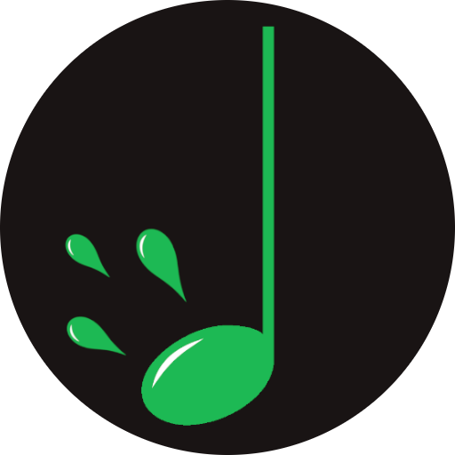

# Phresher
A spotify based project to fetch the newest songs from the artists in a given playlist, written in Go.
## Running locally
Ensure you have your callback setup in the spotify api dashboard for your project. You will also need to set the following environment variables: `SPOTIFY_ID`, `SPOTIFY_SECRET`, and `SPOTIFY_STATE`